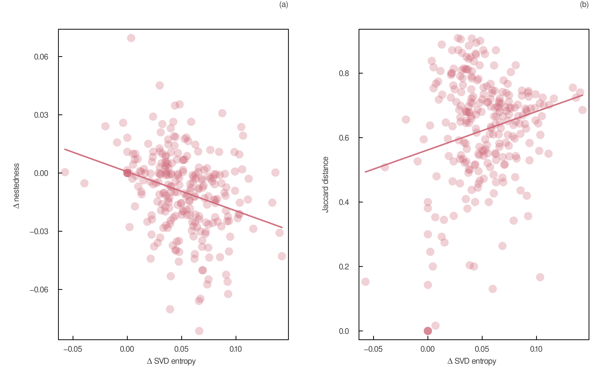
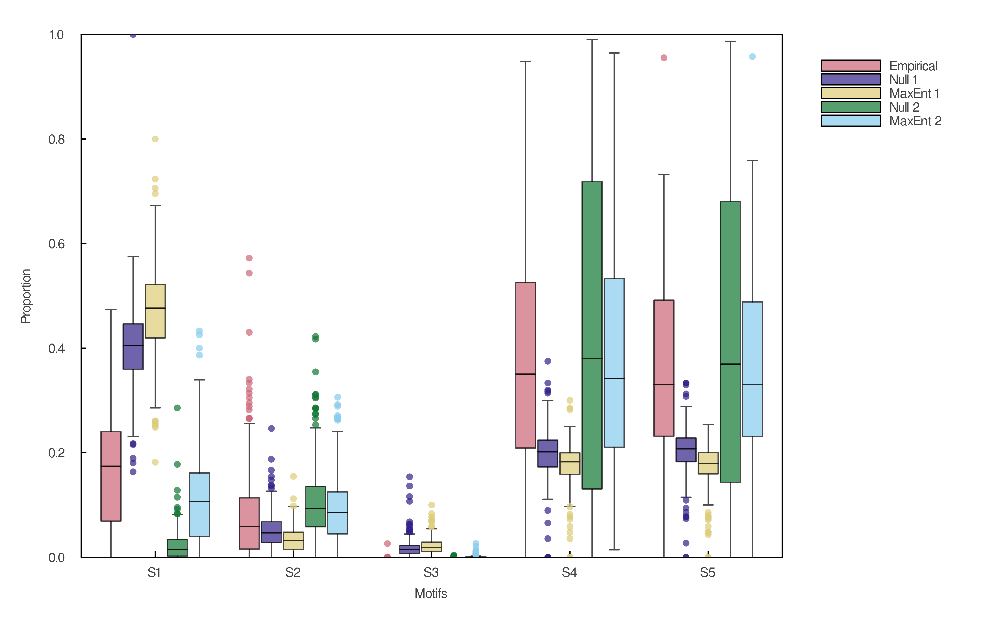
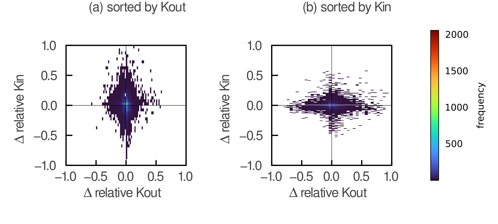
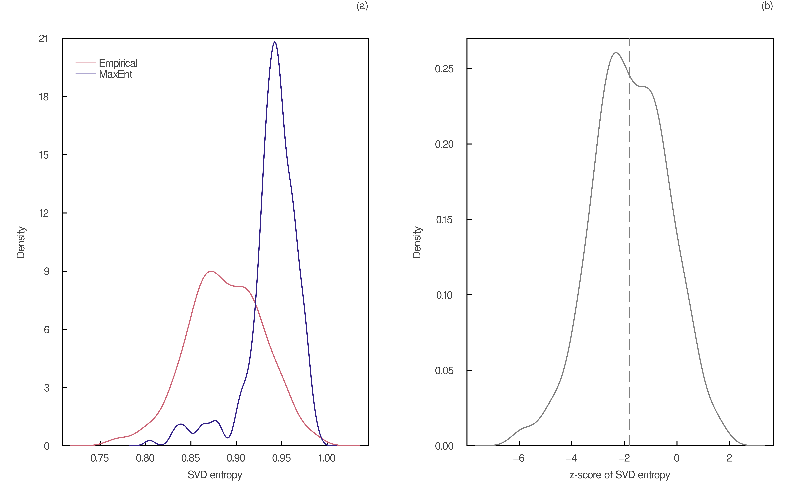
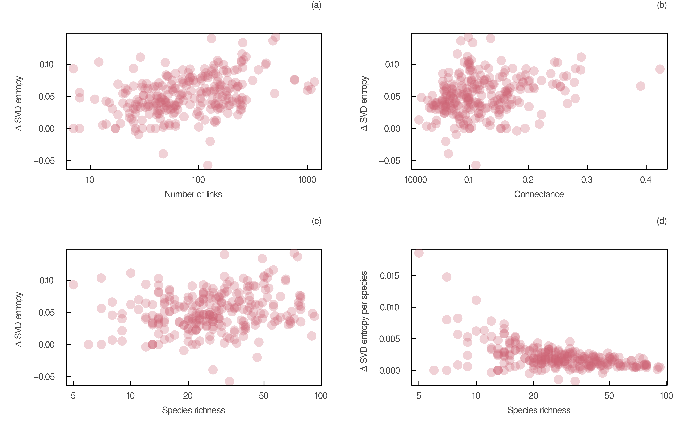

# Introduction 

## Box 1 - The principle of maximum entropy: A primer for ecologists

# Methods

# Maximum entropy models of network structure

## Joint degree distribution 

The joint degree distribution $p(k_{in},k_{out})$ is a joint discrete probability distribution describing the probability that a species has $k_{in}$ predators and $k_{out}$ preys, with $k_{in}$ and $k_{out}$ $\epsilon$ $[0, S]$. Basal species (*e.g.*, plants) have a $k_{out}$ of 0, whereas top predators have a $k_{in}$ of 0. In contrast, the maximum number of preys and predators a species can have is set by the number of species in the food web. Here we show how the joint degree distribution of maximum entropy can be obtained given knowledge of $S$ and $L$.

We want to maximize Shannon's entropy 

$$H = -\sum_{k_{in}=0}^S\sum_{k_{out}=0}^S p(k_{in},k_{out}) \log p(k_{in},k_{out})$${#eq:entropy_jdd}

subject to the following constraints:

$$g_1 = \sum_{k_{in}=0}^S\sum_{k_{out}=0}^S p(k_{in},k_{out}) = 1$${#eq:g1}

$$g_2 = \sum_{k_{in}=0}^S\sum_{k_{out}=0}^S k_{in} p(k_{in},k_{out}) = \langle k_{in} \rangle = \frac{L}{S}$${#eq:g2}

$$g_3 = \sum_{k_{in}=0}^S\sum_{k_{out}=0}^S k_{out} p(k_{in},k_{out}) = \langle k_{out} \rangle = \frac{L}{S}$${#eq:g3}

The first constraint $g_1$ is our normalizing constraint, whereas the other two ($g_2$ and $g_3$) fix the average of the marginal distributions of $k_{in}$ and $k_{out}$ to the linkage density $L/S$. It is important to notice that $\langle k_{in} \rangle = \langle k_{out} \rangle$ because every edge is associated to a predator and a prey. Therefore, without any further constraints, we expect the joint degree distribution of maximum entropy to be a symmetric probability distribution with regards to $k_{in}$ and $k_{out}$. 

The joint probability distribution of maximum entropy given these constraints is found using the method of Lagrange multipliers. To do so, we seek to maximize the following expression.

$$F = H - \lambda_1(g_1-1)-\lambda_2\left( g_2-\frac{L}{S}\right) - \lambda_3 \left( g_3-\frac{L}{S}\right),$${#eq:F_jdd}

where $\lambda_1$, $\lambda_2$, and $\lambda_3$ are the Lagrange multipliers. The probability distribution that maximizes entropy is obtained by finding these values. Note that $F$ is just Shannon's entropy to which we added terms that each sums to zero (our constraints). $F$ is maximized by setting to 0 its partial derivative with respect to $p(k_{in},k_{out})$. Because the derivative of a constant is zero, this gives us:

$$\frac{\partial H}{\partial p(k_{in},k_{out})} = \lambda_1 \frac{\partial g_1}{\partial p(k_{in},k_{out})} + \lambda_2 \frac{\partial g_2}{\partial p(k_{in},k_{out})}+ \lambda_3 \frac{\partial g_3}{\partial p(k_{in},k_{out})}$${#eq:lagrange_jdd}

Evaluating the partial derivatives with respect to $p(k_{in},k_{out})$, we obtain:

$$-\log p(k_{in},k_{out}) - 1 = \lambda_1 + \lambda_2 k_{in} + \lambda_3 k_{out}$${#eq:lagrange2_jdd}

Then, solving @eq:lagrange2_jdd for $p(k_{in},k_{out})$, we obtain:

$$p(k_{in},k_{out}) = \frac{e^{-\lambda_2k_{in}-\lambda_3k_{out}}}{Z},$${#eq:lagrange3_jdd}

where $Z = e^{1+\lambda_1}$ is called the partition function. The partition function ensures that probabilities sum to 1 (our normalization constraint). It can be expressed in terms of $\lambda_2$ and $\lambda_3$ as follows.

$$Z = \sum_{k_{in}=0}^S\sum_{k_{out}=0}^S e^{-\lambda_2k_{in}-\lambda_3k_{out}}$${#eq:Z}

After substituting $p(k_{in},k_{out})$ in @eq:g2 and @eq:g3, we get a nonlinear system of two equations and two unknowns.

$$\frac{1}{Z}\sum_{k_{in}=0}^S\sum_{k_{out}=0}^S k_{in} e^{-\lambda_2k_{in}-\lambda_3k_{out}}  = \frac{L}{S}$${#eq:lagrange4_jdd}

$$\frac{1}{Z}\sum_{k_{in}=0}^S\sum_{k_{out}=0}^S k_{out} e^{-\lambda_2k_{in}-\lambda_3k_{out}}  = \frac{L}{S}$${#eq:lagrange5_jdd}

We solved @eq:lagrange4_jdd and @eq:lagrange5_jdd numerically using the Julia library `JuMP.jl` v0.21.8 [@Dunning2017JumMod] for a range of values of $S$ and $L$. `JuMP.jl` supports nonlinear optimization problems by providing exact second derivatives that increase the accuracy and performance of its solvers. The estimated values of $\lambda_2$ and $\lambda_3$ can be substituted in @eq:lagrange3_jdd to have a more workable expression for the joint degree distribution. 

{#fig:joint_dd}

## Degree distribution 

The degree distribution $p(k)$ represents the probability that a species has $k$ links in a food web, with $k = k_{in} + k_{out}$. It can thus be directly obtained from the joint degree distribution:

$$p(k) = \sum_{i=0}^k p(k_{in} = k - i, k_{out} = i)$$

In @fig:disco_sp, we show that the degree distribution of maximum entropy, given $S$ and $L$, predicts very low probabilities that a species will be isolated in its food web (*i.e.*, having $k=0$). As @MacDonald2020RevLin pointed out, the size of food webs should at least be of $S-1$ links, since a lower number would yield isolated species, *i.e.*, species without any predators or preys. Our results show that, under our purely information-theoretic model, this probability is quite high below this threshold. The expected proportion of isolated species rapidly declines by orders of magnitude with increasing numbers of species and links.  

The degree distribution could also have been obtained directly using the principle of maximum entropy, as discussed in @Williams2011BioMet. This gives the following distribution: 

$$p(k) = \frac{e^{-\lambda_2k}}{Z},$${#eq:lagrange_dd}

with $Z = \sum_{k=0}^S e^{-\lambda_2k}.$

This can be solved numerically using the constraint of the average degree $\langle k \rangle = \frac{2L}{S}$ of a species. Note that the mean degree is twice the value of the linkage density, because every link must be counted twice when we add in and out-degrees together. 

$$\frac{1}{Z}\sum_{k=0}^S k e^{-\lambda_2k} = \frac{2L}{S}$${#eq:lagrange2_dd}

The numerical solution is identical to the one we obtained using the joint degree distribution as an intermediate. Ecologists wanting to model a system without considering isolated species could simply change the lower limit of $k$ to 1 and solve the resulting equation numerically. 

## Box 2 - Working with predicted numbers of links

{#fig:degree_dist_fl}

| measure | Mangal | Mangal-MaxEnt | NZ | NZ-MaxEnt | NZ-Neutral | TL | TL-MaxEnt | TL-Neutral |
|:-------:|:------:|:-------------:|:--:|:---------:|:----------:|:--:|:---------:|:----------:|
| $\rho$ | 0.63 (0.09) | 0.62 (0.08) | 0.62 (0.04) | 0.61 (0.05) | 0.89 (0.05) | 0.68 (0.02) | 0.65 (0.01) | 0.95 (0.02) |
| maxtl | 3.51 (0.72) | 4.12 (1.53) | 2.98 (0.63) | 3.07 (0.90) | 3.75 (0.08) | 3.75 (0.35) | 2.10 (0.00) | NA |
| diam | 2.76 (1.10) | 4.28 (2.06) | 2.05 (0.67) | 2.24 (1.26) | 2.06 (0.24) | 2.50 (0.71) | 5.50 (0.71) | 2.00 (0.00) |
| MxSim | 0.76 (0.13) | 0.54 (0.15) | 0.68 (0.11) | 0.64 (0.10) | 0.91 (0.03) | 0.69 (0.11) | 0.44 (0.02) | 0.94 (0.06) |
| Cannib | 0.04 (0.07) | 0.08 (0.08) | 0.01 (0.02) | 0.02 (0.03) | 0.50 (0.20) | 0.20 (0.01) | 0.15 (0.01) | 0.69 (0.09) |
| Omniv | 0.26 (0.22) | 0.42 (0.24) | 0.22 (0.12) | 0.24 (0.14) | 0.63 (0.18) | 0.64 (0.16) | 0.90 (0.00) | 0.00 (0.00) |
| entropy | 0.89 (0.04) | 0.94 (0.03) | 0.89 (0.02) | 0.93 (0.02) | 0.82 (0.05) | 0.88 (0.01) | 0.96 (0.00) | 0.74 (0.02) |

Table: Caption {#tbl:metrics}

{#fig:metrics}

{#fig:entropy_jaccard}

{#fig:motifs}

# Acknowledgments

We acknowledge that this study was conducted on land within the traditional unceded territory of the Saint Lawrence Iroquoian, Anishinabewaki, Mohawk, Huron-Wendat, and Omàmiwininiwak nations. This work was supported by the Institute for Data Valorisation (IVADO) and the NSERC BIOS$^2$ CREATE program.

\pagebreak

# Supplementary material

![Probability that a species is isolated in its food web according to the degree distribution of maximum entropy**. We derived degree distributions of maximum entropy given a range of values of $S$ and $L$, and plotted the probability that a species has a degree $k$ of 0 (log-scale color bar). Here species richness varies between 5 and 100 species, by increment of 5 species. For each level of species richness, the numbers of links correspond to all 20-quantiles of the interval between 0 and $S^2$. The black line marks the $S-1$ minimum numbers of links required to have no isolated species.](figures/heatmap_disconnected.png){#fig:heatmap}

{#fig:kin_kout_diff}

{#fig:diverge_degree_seq}

{#fig:entropy_dist}

{#fig:metrics_richness}

{#fig:entropy_size}

# MANUSCRIPT PLAN ###################################

# Introduction

- Predicting ecological networks 
    - Importance of predicting ecological networks
    - Different approaches proposed (*e.g.* machine learning, ecological models)
    - Benefits of predicting network structure first 
- Introduction to the use of MaxEnt in ecology
    - Species distribution modelling (SDMs)
    - Maximum entropy theory of ecology (METE)
- Objectives of this paper 
    - Compare different MaxEnt models and predictions with empirical data
    - Compare maximum entropy graph models with neutral models

## The principle of maximum entropy: A primer for ecologists

- Overview of the principle of maximum entropy
    - Least-biased distribution
    - Shannon or Gibbs entropy
    - Constraints
- Finding the maximum entropy distribution 
    - Method of the Lagrange multiplier
    - Example with a single constraint (the mean)

## Prior knowledge on food webs

- Number of species and number of interactions
    - Predicting the number of links (flexible links model)
    - Show predictions of $L$ for my data
- (Joint) degree sequence / distribution 
- Other measures of network structure 
- Number of individuals and number of species

# Methods 
- Maximum entropy models of network structure
- Maximum entropy models of the whole network 
    - Simulating annealing optimizing SVD-entropy
- Neutral models
    - Abundance
    - Joint degree sequence

## Data 

- Food web of Tuesday Lake 
- Food webs in New Zealand
- Data and code availability

# Maximum entropy models of network structure

## Degree distribution of maximum entropy 

- Derivation of the degree distribution constrained by $S$ and $L$
- Figure: Comparison of predictions with data 

## Joint degree distribution of maximum entropy

- Deriving the joint degree distribution constrained by $S$ and $L$
- Figure: Comparison of predictions with data

- Deriving the joint degree distribution constrained by the degree sequence
- Figure: Comparison of predictions with data

## Adjacency matrix of maximum entropy 

- Maximum entropy graph models of directed networks
    - Often over the ensemble (here, it would be of directed simple graphs with or without self-loops)
    - Does not guarantie biological feasibility
    - Models can be very complicated
- Simulating annealing to maximize SVD-entropy 
- Validation procedure 

- Find the network with maximum entropy for a given $S$ and $L$
- Find the network with maximum entropy for a given degree sequemce
- Find the network with maximum entropy for a given joint degree sequence

# Comparison with neutral models

- Deriving the species-abundance relationship of maximum entropy 
- Neutral model using relative abunances
- Neutral model using joint degree sequence
- Comparison of food-web structure of these neutral models with the one of the MaxEnt model constrained by the joint degree sequence

# Discussion

- Explain derivations of my models with empirical data
- Suggest other constraints that could be used
- Explain that my models is essentially a fist-order approximation of network structure or an informative prior

# OLD TEXT #############################################

## A maximum entropy model for predicting food-web structure

We predict the adjacency matrix of maximum entropy using two network-level measures: the number of species $S$ and the number of interactions $L$. While the number of species is a well-described measure of biodiversity for many taxa and locations, the number of interspecific interactions is typically less known. We thus predicted the adjacency matrix using two methods that differ exclusively on the way $L$ was estimated, i.e. empirically or using a predictive statistical model. Most results were obtained using both approaches. Our model thus involves three main steps: (i) the estimation of the number of links, either empirically or using the flexible links model of MacDonald2020RevLina; (ii) the prediction of the joint degree distribution from these two measures using a maximum entropy approach; and (iii) the prediction of the adjacency matrix from the joint degree distribution using a heuristic maximum entropy approach. The next subsections describe each of these steps in detail.

### Predicting the number of links

We used the flexible links model of MacDonald2020RevLina to predict the number of interactions from the number of species. The flexible links model, in contrast to other predictive models of the number of links, incorporates meaningful ecological constraints into the prediction of $L$, namely the minimum $S-1$ and maximum $S^2$ numbers of interactions in food webs. It estimates the proportion of the $S^2 - (S - 1)$ *flexible links* that are realized. More precisely, this model states that the number of *realized* flexible links $L_{FL}$ in a food web represents the number of realized interactions above the minimum (i.e. $L = L_{FL} + S - 1$) and is obtained from a beta-binomial distribution with $S^2 - (S - 1)$ trials and parameters $\alpha = \mu e^\phi$ and $\beta = (1 - \mu) e^\phi$:

$$L_{FL} \sim \mathrm{BB}(S^2 - (S - 1), \mu e^\phi, (1 - \mu) e^\phi),$${#eq:BB}

where $\mu$ is the average probability across food webs that a flexible link is realized, and $\phi$ is the concentration parameter around $\mu$.

We fitted the flexible links model on all food webs archived on Mangal, an extensive ecological interactions database (Poisot2016ManMak). Ecological networks archived on Mangal are multilayer networks, i.e. networks that describe different types of interactions. We considered as food webs all networks mainly composed of trophic interactions (predation and herbivory types). We estimated the parameters of @eq:BB using a Hamiltonian Monte Carlo sampler with static trajectory (1 chain and 3000 iterations):

$$
[\mu, \phi| \textbf{L}, \textbf{S}] \propto \prod_{i = 1}^{m} \mathrm{BB}(L_i - (S_i - 1) | S_i^2 - (S_i - 1)), \mu e^{\phi}, (1 - \mu) e^\phi) \times \mathrm{B}(\mu| 3 , 7 ) \times \mathcal{N}(\phi | 3, 0.5),
$${#eq:BBpost}

where $m$ is the number of food webs archived on Mangal ($m = 235$) and $\textbf{L}$ and $\textbf{S}$ are respectively the vectors of their numbers of interactions and numbers of species. Our weakly-informative prior distributions were chosen following MacDonald2020RevLina, i.e. a beta distribution for $\mu$ and a normal distribution for $\phi$. The Monte Carlo sampling of the posterior distribution was conducted using the Julia library `Turing` v0.15.12 (Ge2018TurLan).

The flexible links model is a generative model, i.e. it can generate plausible values of the predicted variable. We thus simulated 1000 values of $L$ for each value of $S$ ranging between 5 and 1000 species using the joint posterior distribution of our model parameters. We computed the median predicted value of $L$ for each level of species richness. 

### Predicting the adjacency matrix

The joint degree distribution of maximum entropy $p(k_{in},k_{out})$ can be used as a constraint to predict the adjacency matrix of maximum entropy. However, directly deriving a network of maximum entropy considering this constraint is beyond the scope of this paper. Instead, for each level of species richness, we used a heuristic maximum entropy approach in which we simulated networks having the derived joint degree distribution of maximum entropy.

Network simulation was conducted in two steps. First, we estimated the number of species among $S$ species with $k_{in}$ in-degrees and $k_{out}$ out-degrees from the joint probability distribution. Next, we generated 500 random Boolean matrices that maintain the numbers of in and out-degrees for all species in the food web, i.e. matrices constrained by row and column sums. To do so, we used the curveball algorithm of Strona2014FasUnb implemented in the Julia library `RandomBooleanMatrices` v0.1.1. We then computed the SVD-entropy for all simulated networks, and kept the one with the greatest entropy value. Measures of food-web structure (i.e. connectance, nestedness, network diameter, maximum trophic level, and motifs profile) were computed on these maximum entropy matrices for all levels of species richness.

## Data and code availability

All code and data to reproduce this article are available at the Open Science Framework (TK). Our simulations and analyses were conducted in Julia v1.5.4.

# Results

## Degree distributions of empirical and predicted food webs

Figure: 
Degree distributions of food webs archived on Mangal (dotted lines) and of maximum entropy (solid lines). Within each panel, food webs have the same number of species but a different number of links. Black and blue dotted lines correspond to empirical food webs with the smallest and biggest size (i.e. number of interactions), respectively, among all empirical webs of given species richness. Black and blue solid lines correspond to food webs derived using these same numbers of interactions, whereas red solid lines correspond to food webs derived using the median number of interactions given by the flexible links model. (a) $S=7$ species (lower bound of the 97% PI of species richness for all food webs archived on Mangal). Food webs in black and blue have 8 and 12 links, respectively, whereas the food web in red has a total of 8 interactions. Here, the black solid line is hidden behind the blue solid one. (b) $S=27$ species (median of species richness for all food webs archived on Mangal). Food webs in black and blue have 41 and 132 links, respectively, whereas the food web in red has a total of 77 interactions. (c) $S=81$ species (higher bound of the 97% PI of species richness for all food webs archived on Mangal). Food webs in blue have 250 links, whereas the food web in red has a total of 581 interactions. Here, black lines were not plotted, since a single food web archived on Mangal had 81 species. In all panels, note that simulated food webs in black and blue might not have the exact same numbers of interactions as their corresponding empirical webs because of rounding.

Figure: 
Divergence in degree distributions between empirical and predicted food webs as a function of the (a) SVD-entropy of predicted webs and (b) species richness. All empirical food webs were retrieved from the ecological interactions database Mangal. Predicted webs were derived using the same number of species and links as their empirical counterparts. The divergence in degree distributions was computed as the sum of absolute differences between the proportions of species with degree $k$ ($k \in [1,S]$). The fitted regression line was plotted in each panel.

## Other measures of empirical and predicted food webs 

Figure:
Comparison of the structure of empirical and maximum entropy food webs. All empirical food webs were retrieved from the ecological interactions database Mangal. Predicted webs were derived using the same number of species as their empirical counterparts, and either the same number of links (red dots) or the median predicted value of the flexible links model (blue dots). (a) Nestedness (estimated via the spectral radius), (b) the maximum trophic level, (c) the network diameter (i.e. the longest shortest path between all species pairs), and (d) the SVD-entropy were measured on these empirical and predicted food webs. The identity line is plotted in each panel.

Figure:
Motifs profile of (a) empirical and (b) predicted food webs. All empirical food webs were retrieved from the ecological interactions database Mangal. Predicted webs were derived using the same number of species and of links as their empirical counterparts. In each panel, small black dots represent the proportions of each motif in a food web among all motifs that were found in this food web. Boxplots display the median proportions of each motif (middle horizontal lines), as well as the first (bottom horizontal lines) and third (top horizontal lines) quartiles. Vertical lines encompass all data points that fall within 1.5 times the interquartile range from both quartiles, and grey dots are data points that fall outside this range. In both panels, the biggest food web ($S$ = 714 species) was not plotted because of limited computing power. Note that predicted food webs with a number of links given by the flexible links model are not plotted, since their motifs profile was almost identical to the one of panel b. Motifs names are from Stouffer et al. (2007).

Figure:
(a) Distribution of SVD-entropy of MaxEnt food webs predicted with empirical numbers of links (red line), MaxEnt food webs predicted with the median predicted value of the flexible links model (blue line), and of empirical food webs archived on Mangal (yellow line). (b) Distribution of z-scores of the SVD-entropy of all food webs archived on Mangal. Z-scores were computed using the mean and standard deviation of the distribution of SVD-entropy of MaxEnt food webs with numbers of links given by the flexible links model. The dash line correspond to the median z-score of -2.95 (97% PI: [-8.13, 2.08]).

## Relationship between measures 

Figure:
Structure of empirical and maximum entropy food webs as a function of species richness. All empirical food webs (yellow dots) were retrieved from the ecological interactions database Mangal. Predicted webs were derived using the same number of species as their empirical counterparts, and either the same number of links (red dots) or the median predicted value of the flexible links model (blue dots). (a) Nestedness (estimated via the spectral radius), (b) the maximum trophic level, (c) the network diameter (i.e. the longest shortest path between all species pairs), and (d) the SVD-entropy were measured on these empirical and predicted food webs and plotted against species richness. Regression lines are plotted in each panel for empirical (yellow lines) and predicted (red and blue lines) food webs.

Figure:
Nestedness of empirical and maximum entropy food webs as a function of the maximum trophic level. All empirical food webs (yellow dots) were retrieved from the ecological interactions database Mangal. Predicted webs were derived using the same number of species as their empirical counterparts, and either the same number of links (red dots) or the median predicted value of the flexible links model (blue dots). Nestedness was estimated via the spectral radius of the adjacency matrix. Regression lines are plotted for empirical (yellow line) and predicted (red and blue lines) food webs.

# Discussion

# Conclusions

# References
